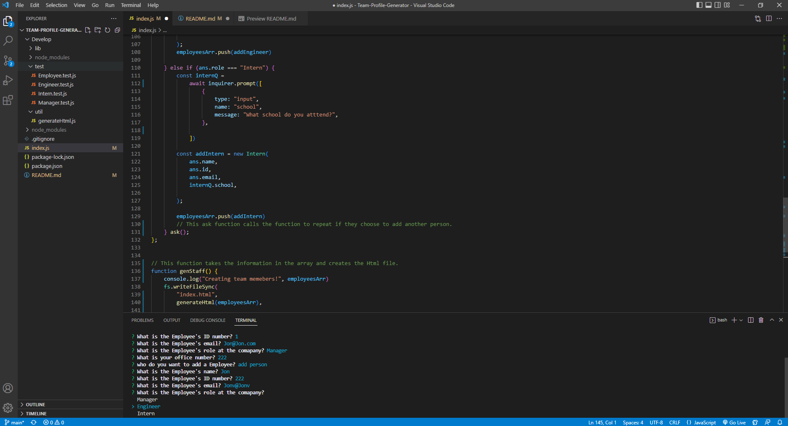
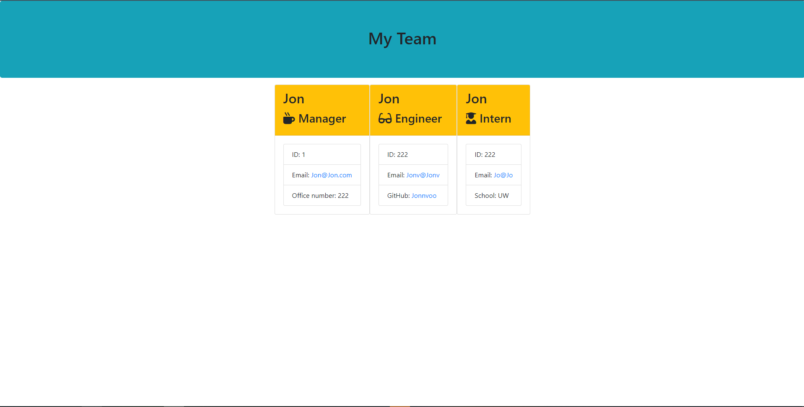

# Team-Profile-Generator

## Description 
This application was made to produce an HTML file once you run it in node.js. You are asked to add a team member to your company. Once you add a team member you are then given a series of questions about that person. Then depending on their role in the company different questions will appear for various roles. You are allowed to add as many team members as you want but once you finished you would then click the "quit" option to exit out the prompts and create your HTML file filled with your team members and their information.

## User Story
AS A manager 
I WANT to generate a webpage that displays my team's basic info 
SO THAT I have quick access to their emails and GitHub profiles 

## Acceptance Criteria
GIVEN a command-line application that accepts user input 
WHEN I am prompted for my team members and their information
THEN an HTML file is generated that displays a nicely formatted team roster based on user input 
WHEN I click on an email address in the HTML 
THEN my default email program opens and populates the TO field of the email with the address 
WHEN I click on the GitHub username 
THEN that GitHub profile opens in a new tab 
WHEN I start the application 
THEN I am prompted to enter the team manager’s name, employee ID, email address, and office number 
WHEN I enter the team manager’s name, employee ID, email address, and office number 
THEN I am presented with a menu with the option to add an engineer or an intern or to finish building my team 
WHEN I select the engineer option 
THEN I am prompted to enter the engineer’s name, ID, email, and GitHub username, and I am taken back to the menu 
WHEN I select the intern option 
THEN I am prompted to enter the intern’s name, ID, email, and school, and I am taken back to the menu 
WHEN I decide to finish building my team 
THEN I exit the application, and the HTML is generated 

## Installation
npm install inquirer@8

## Usage
Install the inquirer package so that you are able to run the prompts when you call the file in node. The command to run the file would "node index.js" after using the command the prompts should run after it's been called on.

## ScreenShot 

Html webpage 

## Link
https://www.youtube.com/watch?v=PnQZUCG7kdE

## Questions 
Message me at these links for further questions.

https://github.com/Jonnvoo 
Jonathanvu2065@gmail.com